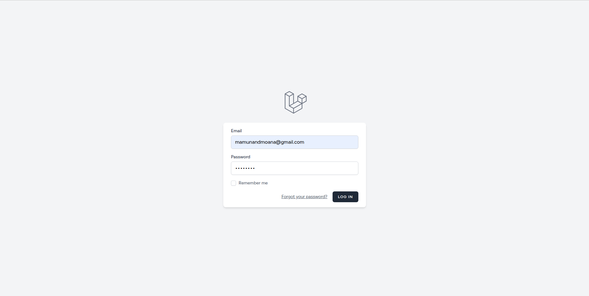
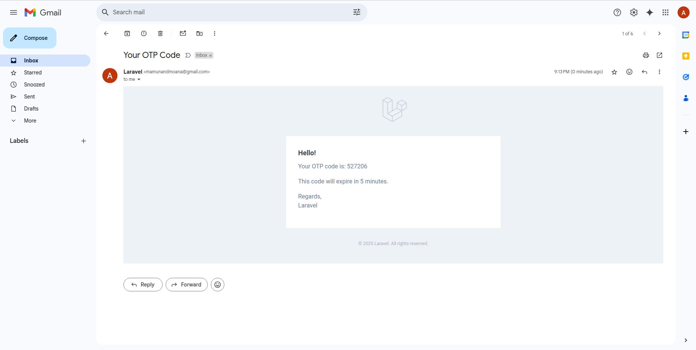
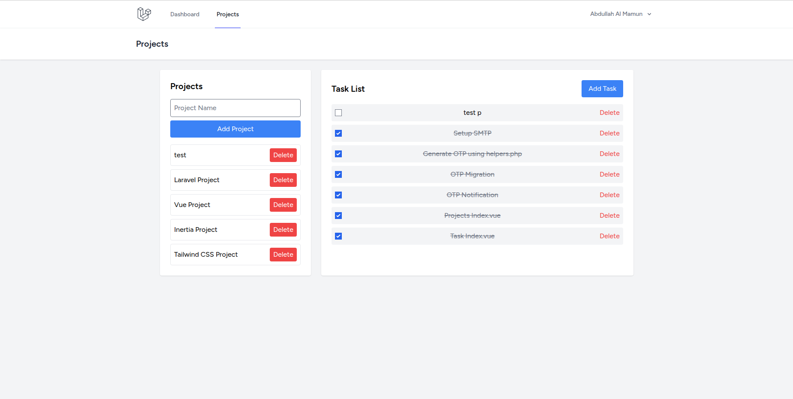

<p align="center"><a href="https://laravel.com" target="_blank"></a></p>

## Laravel OTP and Taks Management System

This project was an interview exam by Flick Media Ltd and I successfully completed the project with all requirements. The project is an OTP and Task Management System built using Laravel 12, Vue, Inertia.js, and TailwindCSS. The system allows users to authenticate using OTP and manage tasks efficiently through an interactive dashboard. 

## Technologies

- Backend: Laravel 12.
- Frontend: Vue.js, Inertia.js.
- UI Framework: TailwindCSS.
- Database: MySQL.
- Authentication: Laravel Breeze (with OTP).
- Task Management: Vue-based interactive dashboard.

## Prerequisites

- PHP 8.2+
- Composer
- Node.js & npm
- MySQL

## Scaffolding

```bash
composer create-project laravel/laravel .
composer require laravel/breeze --dev
php artisan breeze:install vue
npm install
connect database to .env
npm run dev
php artisan serve
php artisan migrate
http://127.0.0.1:8000/
```
## SMTP
Go to Google App Passwords, collect app password, and setup in .env file

```bash
MAIL_MAILER=smtp
MAIL_HOST=smtp.gmail.com
MAIL_PORT=587
MAIL_USERNAME=your_email@gmail.com
MAIL_PASSWORD=your_app_password
MAIL_ENCRYPTION=tls
MAIL_FROM_ADDRESS=your_email@gmail.com
MAIL_FROM_NAME="${APP_NAME}"
```
## OTP Code
Generate 6-digit OTP code using app/helpers.php

```bash
if (!function_exists('generateOtp')) {
    function generateOtp()
    {
        return rand(100000, 999999);
    }
}
```
Make sure helpers.php is included in composer.json file autoload section
```bash
"files": [
            "app/helpers.php"
        ]
```
```bash
composer dump-autoload
```
```bash
php artisan optimize:clear
```
## OTP Migration

```bash
php artisan make:migration add_otp_to_users_table
```
database/migrations/2025_03_01_133946_add_otp_to_users_table.php
```bash
$table->string('otp')->nullable();
$table->timestamp('otp_expires_at')->nullable();
$table->boolean('otp_verified')->default(false);
```
app/Models/User.php
```bash
class User extends Authenticatable
{
    use HasFactory, Notifiable;

    protected $fillable = [
        'name',
        'email',
        'password',
        'otp',
        'otp_expires_at',
        'otp_verified',
    ];

    protected $hidden = [
        'password',
        'remember_token',
    ];

    protected function casts(): array
    {
        return [
            'email_verified_at' => 'datetime',
            'password' => 'hashed',
            'otp_expires_at' => 'datetime',
        ];
    }
}
```
```bash
php artisan migrate
```
## OTP Notification
app/Notifications/OtpNotification.php
```bash
php artisan make:notification OtpNotification
```
## OTP Controller
app/Http/Controllers/Auth/OtpController.php
```bash
php artisan make:controller Auth/OtpController
```
app/Http/Controllers/Auth/AuthenticatedSessionController.php
```bash
  public function store(LoginRequest $request): RedirectResponse
    {
        $request->authenticate();
        $request->session()->regenerate();

        $user = Auth::user();

        Auth::logout();

        // Generate OTP
        $otp = generateOtp();

        // Manually set values and save
        $user->otp = $otp;
        $user->otp_expires_at = Carbon::now()->addMinutes(5);
        $user->otp_verified = false;
        $user->save();

        // Send OTP via email
        $user->notify(new OtpNotification($otp));

        // Store email in session for verification
        Session::put('otp_email', $user->email);

        return redirect()->route('otp.verify');
    }
```
app/Http/Controllers/Auth/RegisteredUserController.php
```bash
public function store(Request $request): RedirectResponse
    {
        $request->validate([
            'name' => 'required|string|max:255',
            'email' => 'required|string|lowercase|email|max:255|unique:' . User::class,
            'password' => ['required', 'confirmed', Rules\Password::defaults()],
        ]);

        $user = User::create([
            'name' => $request->name,
            'email' => $request->email,
            'password' => Hash::make($request->password),
        ]);

        event(new Registered($user));

        Auth::login($user);

        // Generate OTP
        $otp = generateOtp();

        // Manually set values and save
        $user->otp = $otp;
        $user->otp_expires_at = Carbon::now()->addMinutes(5);
        $user->otp_verified = false;
        $user->save();

        // Send OTP via email
        $user->notify(new OtpNotification($otp));

        // Store email in session for verification
        Session::put('otp_email', $user->email);

        // Logout user for otp confirmation
        Auth::logout();

        // Redirect to OTP verification page
        return redirect()->route('otp.verify')->with('message', 'Please check your email to verify your account.');
    }
```

## OTP Route
routes/web.php
```bash
use App\Http\Controllers\Auth\OtpController;

Route::get('/otp-verify', function () {
    return Inertia::render('Auth/OtpVerify');
})->name('otp.verify');

Route::post('/otp-verify', [OtpController::class, 'verifyOtp']);
```
## OTP Vue Component
resources/js/Pages/Auth/OtpVerify.vue

## Project and Task Management
```bash
php artisan make:model Project -mcr
```
- app/Models/Project.php
- database/migrations/2025_03_02_041240_create_projects_table.php
- app/Http/Controllers/ProjectController.php

```bash
php artisan make:model Task -mcr
```
- app/Models/Task.php
- database/migrations/2025_03_02_184316_create_tasks_table.php
- app/Http/Controllers/TaskController.php

## Screenshots
login

OTP sent to email

Project and Task Management


## Github
```bash
If you download this project from Github

composer install
npm install
connect database to .env
connect smtp to .env
php artisan key:generate
php artisan storage:link
php artisan migrate --seed
npm run dev
php artisan serve
```
